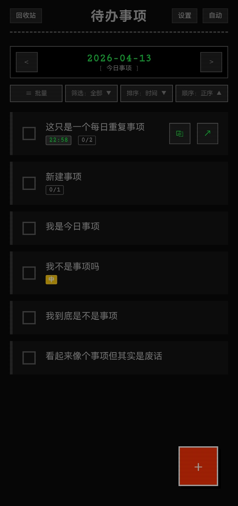
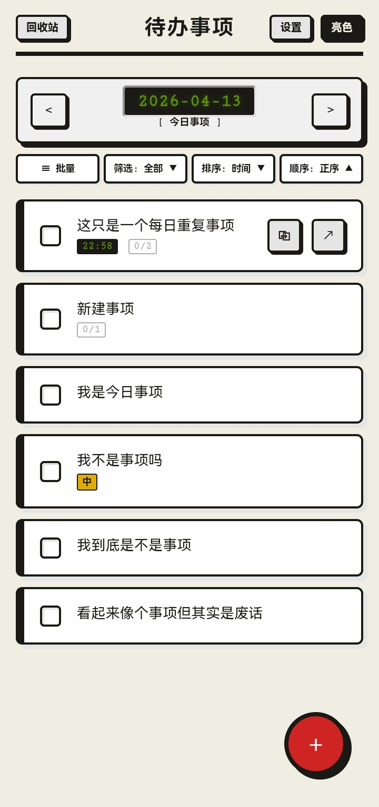
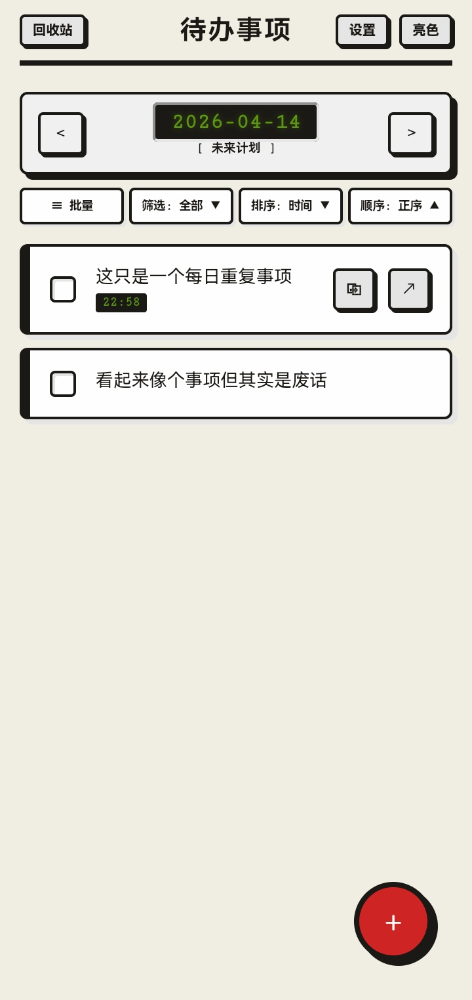
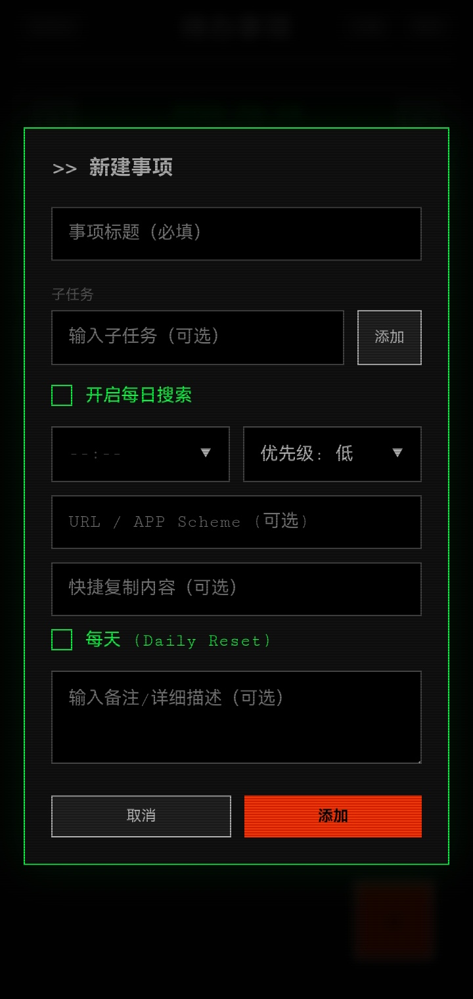
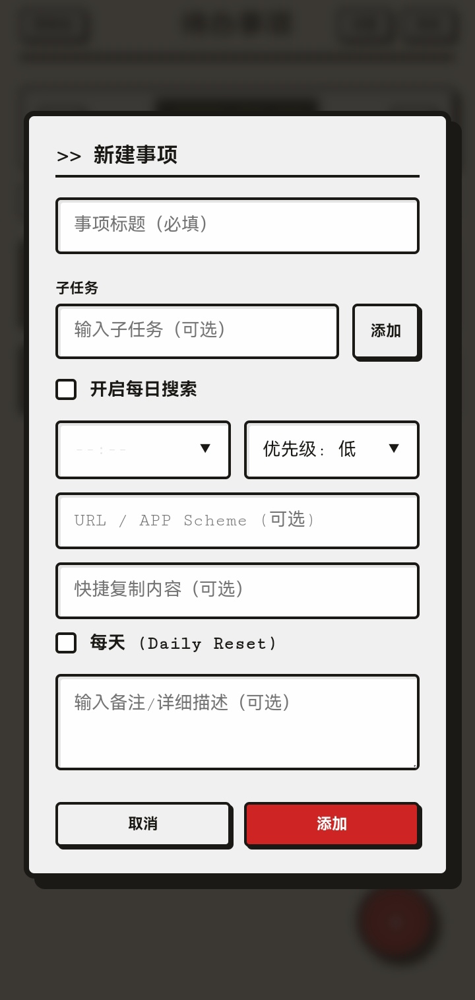
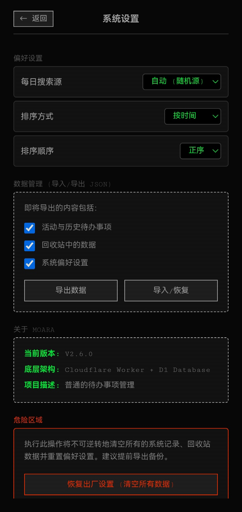
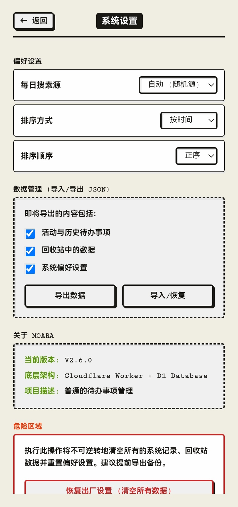
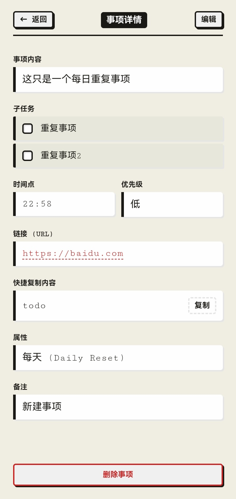

# cf-todo

一个跑在Cloudflare Worker + D1上的待办网页，由AI设计

## 能干什么

- 增删改、标记完成
- 创建子任务拆分步骤，逐个勾掉
- 自动拉取B站/微博/知乎/百度热点共20个，当任务或灵感池用
- 每日重复事项，勾了明天还有
- 回收站防手滑
- 批量操作、筛选排序、导入导出

---

## 环境变量配置

在 Cloudflare Dashboard 中，进入您的 Worker 项目 -> **设置** -> **变量和机密** 中添加以下变量。

| 变量名 | 必填 | 类型 | 默认值 | 说明 |
| :--- | :---: | :--- | :--- | :--- |
| `DB` | **是** | D1 数据库绑定 | 无 | D1 数据库的绑定名称。Worker 依赖此数据库存储数据 |
| `ADMIN_PASSWORD` | **是** | 文本或秘钥 | 无 | 登录密码。连续错误 5 次会锁定该 IP 15 分钟 |
| `JWT_SECRET` | **是** | 文本或秘钥 | 无 | 用于签名和验证用户登录态 Token 的密钥。随机字符串即可 |
| `CUSTOM_HEADER` | 否 | 文本 (HTML代码) | `''` (空) | 自定义头部代码，注入到 head 尾部。适合放 style、外部 CSS、meta 标签等） |
| `CUSTOM_CONTENT` | 否 | 文本 (HTML代码) | `''` (空) | 自定义内容代码，注入到 body 尾部。适合放 script、HTML 片段等 |

---

## 配置指南

### 1. 创建 Worker 项目，选择从 Hello world 开始

### 2. 数据库绑定

这是运行该项目的基础，配置步骤：

1. 在 Cloudflare Dashboard 左侧菜单选择 **存储和数据库 > D1 SQL 数据库**，创建一个数据库。
2. 进入您的 Worker 项目，选择 绑定
3. 点击 **添加绑定**，选择 **D1 数据库**。
4. **变量名称** 必须填入：`DB`
5. 选择刚刚创建的 D1 数据库 -> 添加绑定。

### 3. 核心密钥配置

1. 在 Worker 项目的 **设置** -> **变量和机密** 中。
2. 点击 **添加变量**。
3. 类型选文本或秘钥，添加变量名称 `ADMIN_PASSWORD` 和 `JWT_SECRET`。
4. 建议填写强密码/密钥串。

### 4. 前端定制配置

1. 同样在 **变量和机密** 中添加。
2. 类型选文本，添加变量名称 `CUSTOM_HEADER` 和 `CUSTOM_CONTENT`。
3. 值填写 HTML/CSS/JS 代码（无需转义，直接填写原始代码即可）。
4. 默认**关闭**前端定制注入。需要在网站“设置 -> 前端定制”中启用前端定制注入并点击保存才会生效。

## 使用方法

- 右下角 `+` 建任务，可填子任务、时间、优先级、链接、快捷复制内容
- 点任务看详情，点「编辑」修改
- 右上设置调整偏好、备份数据、清空重开
- 备注支持Markdown的加粗、斜体、删除线

## 截图

  
  
  

  
  
  

  
  

